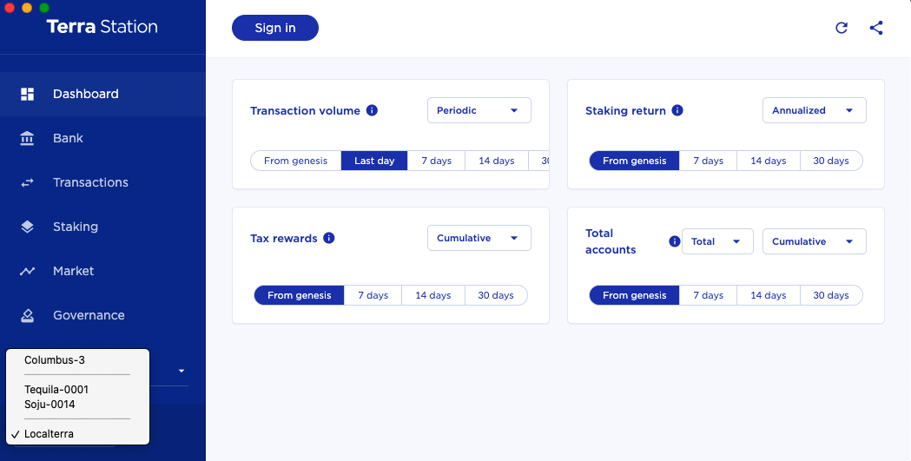

<p>&nbsp;</p>
<p align="center">

</p>

<p align="center">
Instant, zero-config Terra blockchain and ecosystem.
</p>

<br/>

## What is LocalTerra?

LocalTerra is a complete Terra testnet and ecosystem containerized with Docker and orchestrated with a simple `docker-compose` file, designed to make it easy for smart contract developers to test out their contracts on a sandboxed environment before moving to a live testnet or mainnet.

LocalTerra comes pre-configured with opinionated, sensible defaults for a standard testing environment. If other projects mention testing on LocalTerra, they are referring to the settings defined in this repo.

The advantages of LocalTerra over a public testnet are that:

- world state is easily modifiable
- quick to reset for quick iterations
- easy to simulate different scenarios
- validator behavior is controllable

## Requirements

- [Docker](https://www.docker.com/) installed and configured on your system
- [`docker-compose`](https://github.com/docker/compose)
- Supported known architecture: x86_64

## Usage

```sh
$ git clone --depth 1 https://www.github.com/terra-money/LocalTerra
$ cd LocalTerra
```

Make sure your Docker daemon is running in the background and `docker-compose` is installed. Then start LocalTerra:

```sh
$ docker-compose up
```

You should now have an environment with the following:

- [terrad](http://github.com/terra-money/core) RPC node running on `tcp://localhost:26657`
- LCD running on http://localhost:1317
- [FCD](http://www.github.com/terra-money/fcd) running on http://localhost:3060
- an oracle feeder feeding live prices from mainnet, trailing by 1 vote period

If you need to turn off LocalTerra:

```sh
$ docker-compose stop
```

To reset the world state, issue the following:

```sh
$ docker-compose rm
```

## LocalTerra and...

### Terra Station

Terra Station has built-in support for LocalTerra, which enables you to interact with your LocalTerra. Open up station and switch to the `Localterra` network:



### terracli

Make sure you have the same version of `terracli` installed as LocalTerra. Then, you can use `terracli` to talk to your LocalTerra `terrad` node:

```sh
$ terracli status
```

This automatically works because `terracli` connects to `localhost:26657` by default. More explicitly:

```sh
$ terracli status --node=tcp://localhost:26657
```

You should now be able to issue normal commands with `terracli` against your LocalTerra network:

```sh
$ terracli query account terra1dcegyrekltswvyy0xy69ydgxn9x8x32zdtapd8
```

### Terra SDK for Python

You can connect to the chain through LocalTerra's LCD server.

```python
from terra_sdk.client.lcd import LCDClient
terra = LCDClient("localterra", "http://localhost:1317")
```

### Terra.js

You can connect to the chain using `LCDClient` against LocalTerra's LCD server.

```ts
import { LCDClient } from "@terra-money/terra.js";

const terra = new LCDClient({
  URL: "http://localhost:1317",
  chainID: "localterra",
});
```

## Configuring LocalTerra

Since the majority of LocalTerra is implemented through a `docker-compose.yml` file, it is easily customizable and can be considered a starting template point for setting up your own local Terra testnet with Docker containers. Out-of-the-box, LocalTerra comes preconfigured with opinionated settings such as:

- ports defined for RPC (26657), LCD (1317) and FCD (3060)
- standard [accounts](#accounts) (shown below)

### Modifying Node Configuration

You can modify the node configuration of your validator in `config/config.toml` and `config/app.toml`.

#### PRO TIP: Speed Up Block Time

LocalTerra is often used alongside a script written with Terra.js or Terra Python SDK as a convenient way to do integration tests. You can greatly improve the experience by speeding up the block time. Go ahead and edit `config/config.toml`'s `[consensus]` parameters. Here, we have chosen to replace all timeouts to `200ms`, but you can experiment with other values.

```diff
##### consensus configuration options #####
[consensus]

wal_file = "data/cs.wal/wal"
- timeout_propose = "3s"
- timeout_propose_delta = "500ms"
- timeout_prevote = "1s"
- timeout_prevote_delta = "500ms"
- timeout_precommit_delta = "500ms"
- timeout_commit = "5s"
+ timeout_propose = "200ms"
+ timeout_propose_delta = "200ms"
+ timeout_prevote = "200ms"
+ timeout_prevote_delta = "200ms"
+ timeout_precommit_delta = "200ms"
+ timeout_commit = "200ms"
```

Or use this one-liner:

```sh
sed -E -i '/timeout_(propose|prevote|precommit|commit)/s/[0-9]+m?s/200ms/' config/config.toml
```

### Modifying Genesis

If you need to change the `genesis.json` file, you can alter it in `config/genesis.json`. This will get loaded when you reset your LocalTerra network.

## Accounts

LocalTerra is pre-configured with one validator and 10 accounts with LUNA balances.

| Account   | Address                                                                                                  | Mnemonic                                                                                                                                                                   |
| --------- | -------------------------------------------------------------------------------------------------------- | -------------------------------------------------------------------------------------------------------------------------------------------------------------------------- |
| validator | `terra1dcegyrekltswvyy0xy69ydgxn9x8x32zdtapd8`<br/>`terravaloper1dcegyrekltswvyy0xy69ydgxn9x8x32zdy3ua5` | `satisfy adjust timber high purchase tuition stool faith fine install that you unaware feed domain license impose boss human eager hat rent enjoy dawn`                    |
| test1     | `terra1x46rqay4d3cssq8gxxvqz8xt6nwlz4td20k38v`                                                           | `notice oak worry limit wrap speak medal online prefer cluster roof addict wrist behave treat actual wasp year salad speed social layer crew genius`                       |
| test2     | `terra17lmam6zguazs5q5u6z5mmx76uj63gldnse2pdp`                                                           | `quality vacuum heart guard buzz spike sight swarm shove special gym robust assume sudden deposit grid alcohol choice devote leader tilt noodle tide penalty`              |
| test3     | `terra1757tkx08n0cqrw7p86ny9lnxsqeth0wgp0em95`                                                           | `symbol force gallery make bulk round subway violin worry mixture penalty kingdom boring survey tool fringe patrol sausage hard admit remember broken alien absorb`        |
| test4     | `terra199vw7724lzkwz6lf2hsx04lrxfkz09tg8dlp6r`                                                           | `bounce success option birth apple portion aunt rural episode solution hockey pencil lend session cause hedgehog slender journey system canvas decorate razor catch empty` |
| test5     | `terra18wlvftxzj6zt0xugy2lr9nxzu402690ltaf4ss`                                                           | `second render cat sing soup reward cluster island bench diet lumber grocery repeat balcony perfect diesel stumble piano distance caught occur example ozone loyal`        |
| test6     | `terra1e8ryd9ezefuucd4mje33zdms9m2s90m57878v9`                                                           | `spatial forest elevator battle also spoon fun skirt flight initial nasty transfer glory palm drama gossip remove fan joke shove label dune debate quick`                  |
| test7     | `terra17tv2hvwpg0ukqgd2y5ct2w54fyan7z0zxrm2f9`                                                           | `noble width taxi input there patrol clown public spell aunt wish punch moment will misery eight excess arena pen turtle minimum grain vague inmate`                       |
| test8     | `terra1lkccuqgj6sjwjn8gsa9xlklqv4pmrqg9dx2fxc`                                                           | `cream sport mango believe inhale text fish rely elegant below earth april wall rug ritual blossom cherry detail length blind digital proof identify ride`                 |
| test9     | `terra1333veey879eeqcff8j3gfcgwt8cfrg9mq20v6f`                                                           | `index light average senior silent limit usual local involve delay update rack cause inmate wall render magnet common feature laundry exact casual resource hundred`       |
| test10    | `terra1fmcjjt6yc9wqup2r06urnrd928jhrde6gcld6n`                                                           | `prefer forget visit mistake mixture feel eyebrow autumn shop pair address airport diesel street pass vague innocent poem method awful require hurry unhappy shoulder`     |

## License

This software is licensed under the MIT license.

© 2020 Terraform Labs, PTE.

<hr/>

<p>&nbsp;</p>
<p align="center">
    <a href="https://terra.money/"></a>
</p>
<div align="center">
  <sub><em>Powering the innovation of money.</em></sub>
</div>
